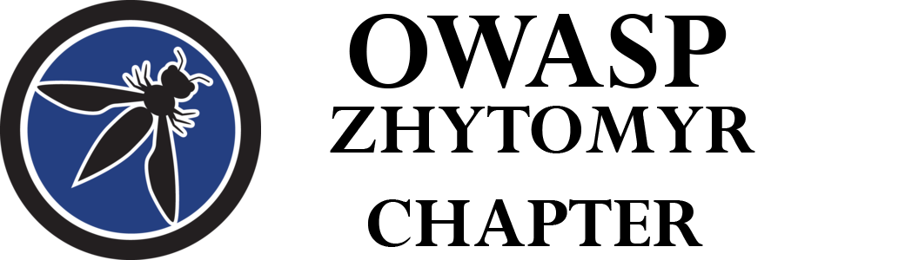

---

layout: col-sidebar
title: OWASP Zhytomyr
tags: supporters-tag cfp-tag past2019-tag past2020-tag past2021-tag event2021-tag
level: 0

region: Europe
meetup-group: OWASP-Zhytomyr-Chapter
country: Ukraine
postal-code: 

---
## OWASP 20th Anniversary Event

OWASP will be celebrating its [20th Anniversary](https://20thanniversary.owasp.org/) on September 24, 2021!  We will be hosting a live virtual 24-hour global event. [Registration](https://www.eventbrite.com/e/owasps-20th-anniversary-event-celebration-tickets-152915084133) is free for all to attend!

## Who are we

OWASP Zhytomyr chapter was founded in 2019 by [Bohdan Nikitenko](mailto:bohdan.nikitenko@owasp.org)

Second leader is [Julia Potapenko](mailto:julia.potapenko@owasp.org)

The chapter aims at holding quarterly meetups in the format of 4 talks and probably 1 workshop.

## How to find us

Follow our news and announcements on social media:
[Facebook](https://www.facebook.com/owaspzhytomyr/)
[Telegram](https://t.me/OWASP_ZHYTOMYR_OFFICIAL)
[Meetup](https://www.meetup.com/OWASP-Zhytomyr-Chapter/events/)

## How to support the chapter

If your company wishes to support the chapter, please contact [Bohdan Nikitenko](mailto:bohdan.nikitenko@owasp.org) or [Julia Potapenko](mailto:julia.potapenko@owasp.org)

# Future Events

## Become a Speaker

Call For Speakers at OWASP Zhytomyr events is permanently open. If you want
to present at future events simply send the title and abstract
of your talk and speaker bio to [Bohdan Nikitenko](mailto:bohdan.nikitenko@owasp.org) or [Julia Potapenko](mailto:julia.potapenko@owasp.org)

## Become a Sponsor

To sponsor an OWASP Zhytomyr event, contact [Bohdan Nikitenko](mailto:bohdan.nikitenko@owasp.org) or [Julia Potapenko](mailto:julia.potapenko@owasp.org)

We don't have any special sponsorship package, however the sponsoring
organization or individual will receive our warm thanks and a fair
amount of gratitude spread over our social media presence, placed at the
chapter official web-page, and announced at the event itself

## Become a Host

To host an OWASP Zhytomyr event, contact [Bohdan Nikitenko](mailto:bohdan.nikitenko@owasp.org)
Venue requirements include:

  - Capacity to welcome up to 40-50 attendees
  - Separate high-quality internet connection for online streaming
  - No need for additional attendee registration or providing attendee
    lists
  - No marketing, advertising, or hiring at the event

## Announcements

---
