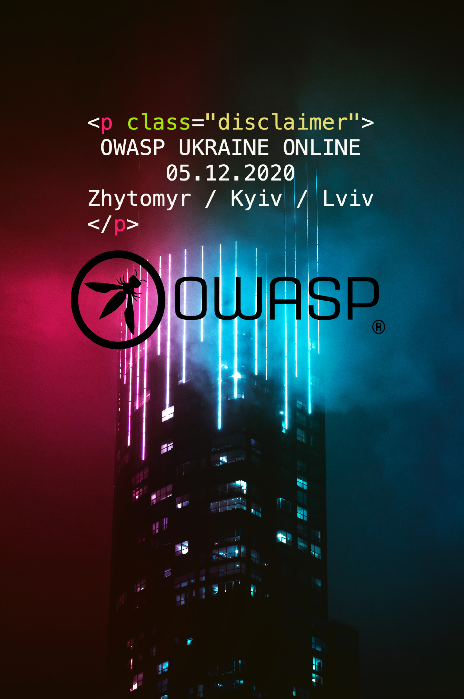

## When?
December 5
11:00

## Where?
Streamyard

## Zhytomyr is main org!
Welcome to the sixth annual OWASP Ukraine 2020 conference - the largest Application Security conference in Ukraine, organized by OWASP Zhytomyr, Kyiv and Lviv. This year the conference will be held on December 5 in the format of an online meetup. We have interesting reports from speakers from Ukraine and beyond, workshops and raffles with cool prizes. And it's all free!

## Schedule (could be changed)
11:00 Opening + lottery/raffles announcement

11:25 Maksym Khramov & Serhii Korolenko - 6 digit OTP for Two Factor Auth (2FA) is brute-forceable in 3 days + OTP Lottery

11:45 Julia Potapenko - React Native Security: Addressing Typical Mistakes

12:30 Константин Корсун - Безпека додатку Дія - "Оскар" чи "Золота малина”

13:30 Anatolii Bereziuk - OAuth2.0: What? Where? When?

14:30 Lottery/raffles updates

14:40 Serhii Korolenko & Eduard Kiiko & Oksana Safronova - OWASP JuicyShop Workshop

16:00 Philippe Humeau - Leveraging the crowd power to regain faith in Internet’s zero trust architecture (in English)

17:00 Pawel Rzepa - Serverless security: attack & defense (in English)

18:00 Lottery/raffles results 

18:30 Closing word

## Meetup link with details:
[Meetup](https://www.meetup.com/OWASP-Zhytomyr-Chapter/events/274658398/)