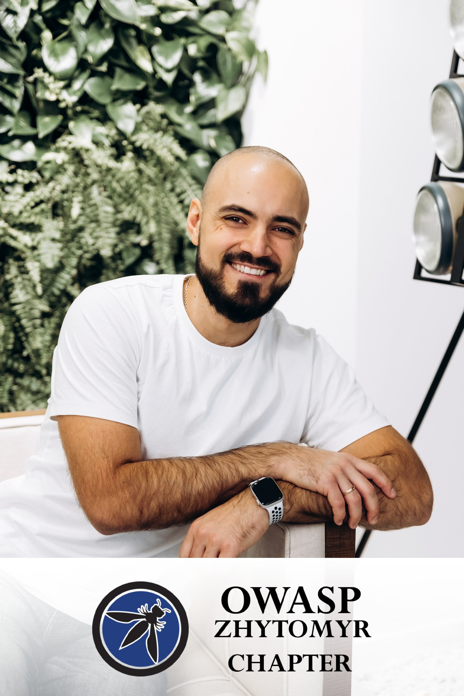
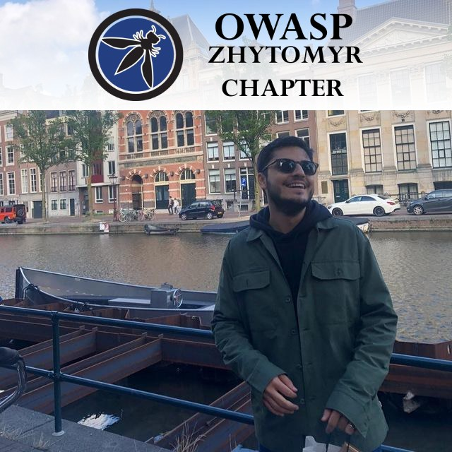
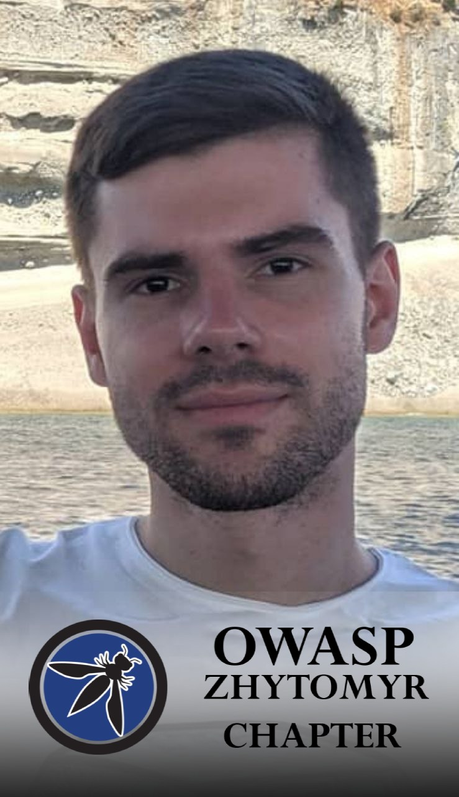
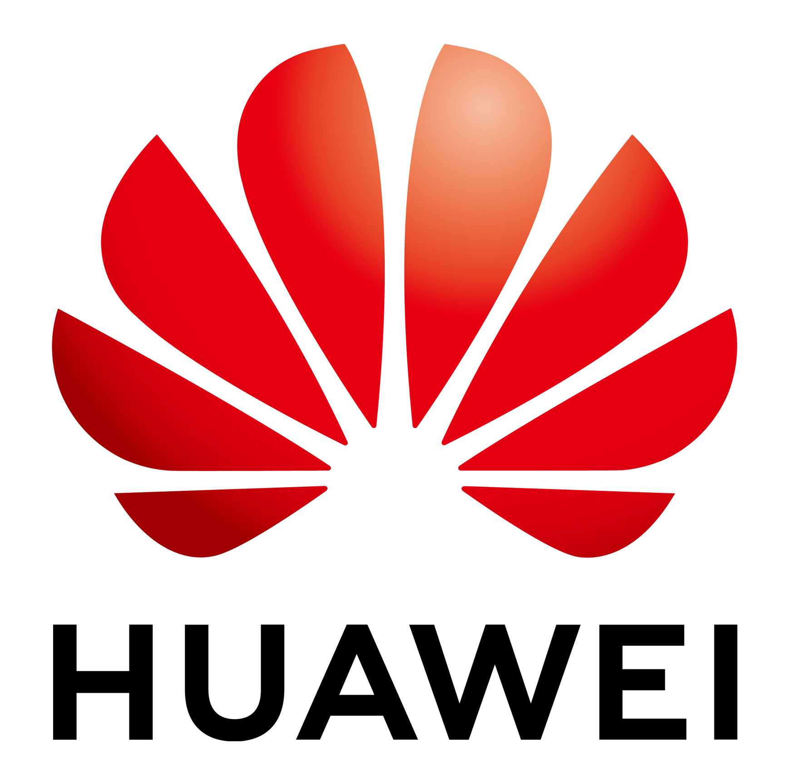

# Chapter Webinars 2021

## OWASP Zhytomyr 2021 Meetup #3

## When?
24.11.2021
19:00

## Where?
YouTube

## Meetup link with details:
[Meetup](https://www.meetup.com/OWASP-Zhytomyr-Chapter/events/281782803/)

## Details and description:
Attention please! Because we are going to rock all the things on our next OWASP ZHYTOMYR #3 meetup!
This event will be held online.
24.11.2021 at 19:00.
By the way, we are ready to announce our speakers!

-------------------------------------------------------------------------------

### Please, meet our first speaker!

Artur is a security engineer at Cossack Labs, CISSP, with more than 8 years spent in the security trenches – breaking & improving mobile apps, web apps, and huge infrastructures.

During his talk we will discuss how to setup testing environment (root an Android emulator, how to integrate Burp Suite correctly, etc), which tools to use to make your life as a security researcher nice & easy.

Using this research lab, I’ll show you how different apps implement certain OWASP MASVS requirements – like certificate pinning, or root protection. We will see where to look to spot the missing security controls.

-------------------------------------------------------------------------------

### Okay, next speaker! Meet Ali Huseyn!

Ali will tell us about Reconnaissance in Hacking.
This speech is going to be about the reconnaissance stage in hacking. During the presentation, we will cover several topics, such as what is intelligence gathering, why is recon so important, and how to collect the necessary information at this stage.
Ali Huseyn Aliyev (@chmodxrw)

-------------------------------------------------------------------------------

### OWASP Zhytomyr last but not least speaker, Dmytro Pavlov!

Dima is a Security engineer/penetration tester at Ciklum.
Talk: “JS prototype pollution 101”
Description: Prototype pollution vulnerability might vary from “extremely dangerous threat that resulted into RCE” to “harmless deviation from best practices”. In this talk will be covered how prototype pollution works, how it can be used by attackers with different examples.

-------------------------------------------------------------------------------

### Aaaand of course our sponsor! Welcome Huawei!

"HUAWEI – це світовий лідер на ринку телекомунікаційного обладнання, а також один з п’яти найбільших R&D інвесторів. Створюючи інтегровані рішення в чотирьох основних областях (телекомунікаційні мережі, ІТ, «розумні» пристрої і хмарні сервіси), ми прагнемо відкрити цифровий світ, в якому все є інтелектуальним і взаємопов'язаним, для кожної людини, оселі та організації. Компанія надає послуги понад 1500 операторам зв’язку та трьом мільярдам кінцевих користувачів у 170 країнах світу.

Кібербезпека та захист персональних даних є пріоритетами Huawei. У своїй діяльності компанія дотримується кращих світових практик та стандартів з безпечної розробки та захисту програмного забезпечення, а також робить власний вагомий внесок у розвиток відповідних стандартів. Компанія вкладає значні кошти в фундаментальні дослідження, концентруючись на технологічних проривах, які просувають світ уперед."

## See you!

