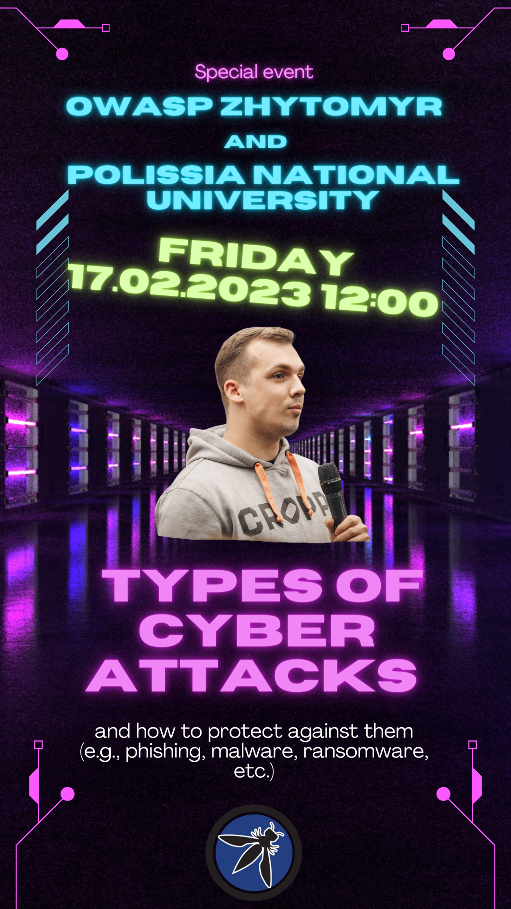

title: event2023
displaytext: Event 2023
layout:  null
tab: true
order: 7
tags: event2023-tag
---

Welcome to the first OWASP Zhytomyr event in 2023!
## OWASP Zhytomyr Meetup 2023 #1

## When?
Feb 17
12:00

## Where?
Zhytomyr Polissya National University

## Description
Шановне товариство!
Цієї пʼятниці (17.02.2023) на базі Поліського Національного Університету відбудеться сумісна з OWASP Zhytomyr подія.
Лідер чаптеру Богдан Нікітенко виступить з презентацією на тему “Types of cyber attacks and how to protect against them”
Подія відбудеться о 12.00.
Всім, хто відноситься до напрямку КБ бути обовʼязково.