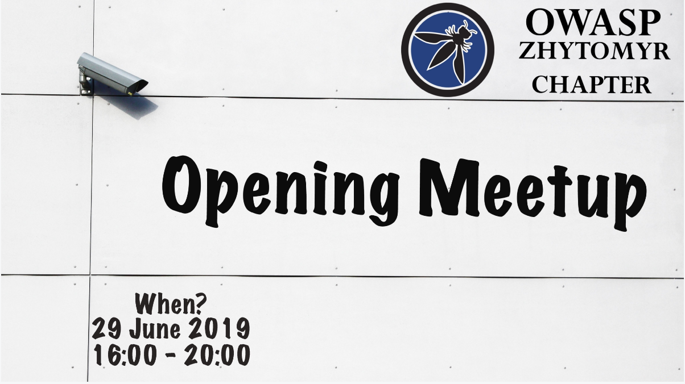

### Chapter Webinars 2019

## When?
29 June 2019
16:00 - 20:00

## Where?
Reikartz Hotel (2d floor). Zamkova Square, 5/8, Zhytomyr, 10002

## Our Speakers

1. Oleg Yudintsev
Independent InfoSec Researcher
How tasty are your cookies?

How cookies can leak over insecure channel? How an Attacker can tamper or hijack remotely sensitive cookies of the user? What severe consequences can happen as a result of insecure cookie processing? In this presentation I'm going discuss different weaknesses in cookie lifecycle and how to process cookies securely.

2. Julia Potapenko
iOS Software Engineer at Stuzo
Touch ID and Face ID. Is it secure?

Even though Touch ID and Face ID have been here for a while, the users continue to ask if they are secure enough. We will talk about Apple's Biometrics, Keychain and Secure Enclave, looking into the proper way local authentication should be implemented on iOS devices.

3. Oleksandr Mezherytskyi
Cybersecurity Engineer at Armed Forces of Ukraine
STOP DDOS

Oleksandr will tell us about his own experience and practical advices on how to stop attacks on web sites - fitches, tools, and mistakes.

4. Yulia Vashchenko
macOS Software Engineer at MacPaw
Malware on macOS: hottest news from Objective by the Sea conference
