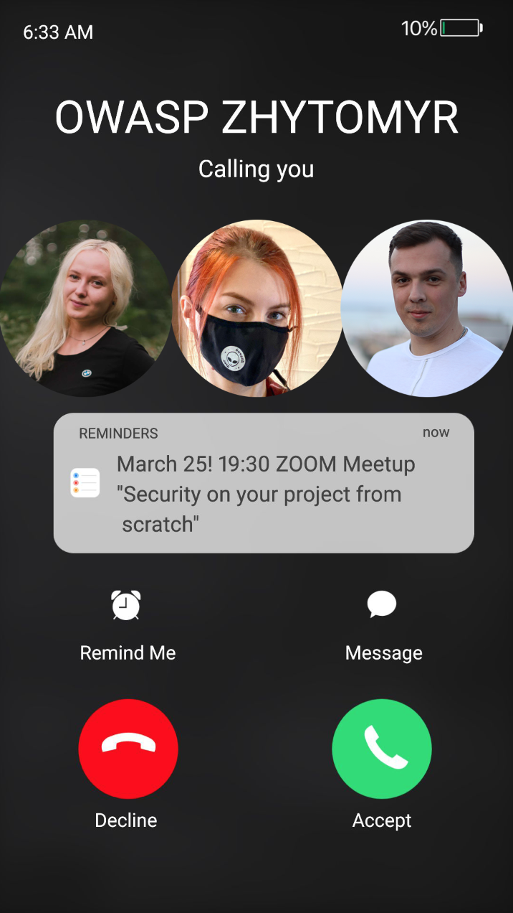
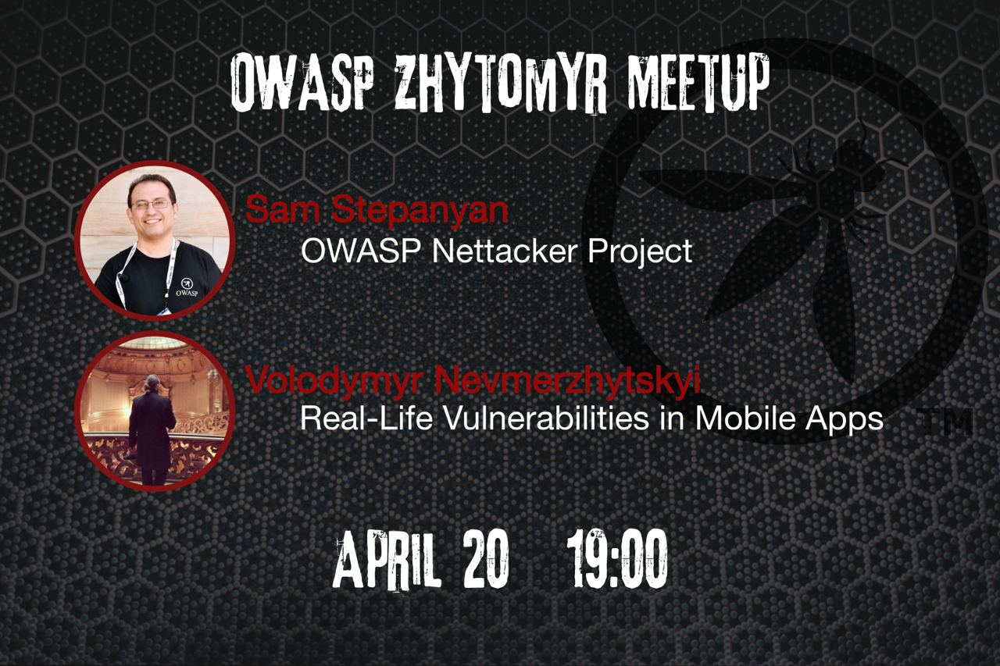

## №1 OWASP Zhytomyr Spring Meetup 2021

## When?
March 25
19:30

## Where?
Zoom conference

## Meetup link with details:
[Meetup](https://www.meetup.com/OWASP-Zhytomyr-Chapter/events/276956783)

Spring is here! And it means we celebrate OWASP Zhytomyr Birthday with an inspirational meetup. 

Let’s meet in a friendly atmosphere and discuss security with our special guest – Anastasi Vixentael. 

No slides and boring lectures. We’ll talk about "Security on your project from scratch". The questions from the audience will be very welcome! Join us on March 25, 19:30, online.

-------------------------------------------------------------------------------------------------------

## №2 OWASP Zhytomyr Spring Meetup 2021

## When?
April 20

19:00

## Where?
Zoom conference

## Meetup link with details:
[Meetup](https://www.meetup.com/OWASP-Zhytomyr-Chapter/events/277380259/?isFirstPublish=true)

It's getting hot with so many events from Ukrainian OWASP Chapters. Last month we had a great interview-style meetup, and we are ready again to bring you two awesome speakers.

Sam Stepanyan is an OWASP London Chapter Leader and an Independent Application Security Consultant with over 20 years of experience.
His talk is about the OWASP Nettacker Project, one of OWASP's "Unsung Hero" projects. Nettacker is a little-known yet awesome and powerful 'swiss-army-knife' type tool for information gathering and vulnerability scanning.

Volodymyr Nevmerzhytskyi has more than 6 years of experience in mobile app development, and as of right now, he is leading a banking app project.
In his talk, he will show us common mobile app vulnerabilities in real-life examples. He'll demonstrate how to fix them and protect from further attacks.