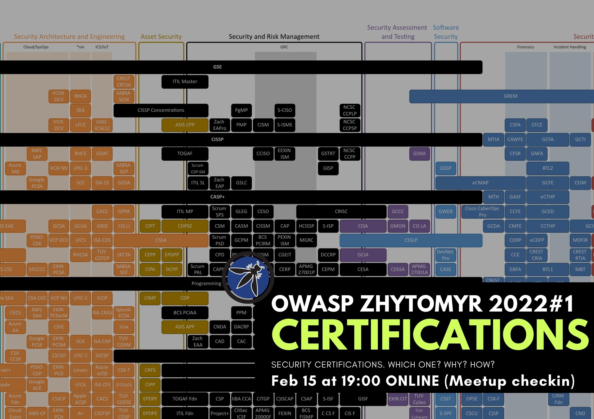

## OWASP Zhytomyr Meetup 2022 #1

## When?
Feb 15
19:00

## Where?
YouTube stream

## Meetup link with details:
[Meetup](https://www.meetup.com/OWASP-Zhytomyr-Chapter/events/283709880/)

OWASP Zhytomyr starts this year with a practical topic - gaining certifications: which one to choose, are they useful, and what the process is. 
By the way, we have a special guest - Oleksii Baranovskyi. He has big amount of certifications from (ISC)², ISACA, EC-Council, CompTIA, etc. 

Join OWASP Zhytomyr Youtube stream on February 15 at 19:00. Language: Ukrainian/Russian.

Stay tuned for updates!